# Hi, I'm Pero 👋

I'm a first-year software development student at Algebra Bernays University in Croatia.

Before transferring to Algebra Bernays University, I completed one year of programming studies at VSITE. I enjoy learning through practical projects and exploring different areas of software development.

## 👨‍💻 About Me

- 🎓 First-year software development student
- 🐍 Currently focused on improving my Python skills
- 🛠️ I learn best by building practical projects
- 🌱 Currently exploring different programming languages and technologies

## 🛠️ Technologies and Tools

### Languages

### Development Tools

## 🚀 Featured Projects

### ⚽ Club Rise

A football club management game where the player manages a squad, transfers, facilities, finances, tactics, and season progression.

**Built with:** React Native, Expo and TypeScript

[View repository](https://github.com/perogavranic0/FootballManager)

---

### 📦 Product Inventory Tracker

Full-stack inventory management application built with React, FastAPI and PostgreSQL.

**Built with:** React, FastAPI, SQLAlchemy, PostgreSQL and Python

[View repository](LINK_DO_REPOSITORYJA)

---

### 🦷 Retainer Reminder

A mobile application that helps users remember to wear their dental retainer and track their daily progress and streak.

**Built with:** React Native, Expo and TypeScript

[View repository](https://github.com/perogavranic0/Retainer-Reminder)

You can get the app here: https://play.google.com/store/apps/details?id=com.retainerreminder.app

---

### 👑 GridKing

Worked on the game starting screen and helped with the visuals.

[View repository](https://github.com/ValentinaGavranic/GridKing)

---

### 🧠 Bench Boss

A football strategy game where players make tactical decisions, build their defense, and complete increasingly difficult challenges.

**Built with:** React Native, Expo and TypeScript

[View repository](https://github.com/perogavranic0/BenchBoss)

---

### 🐍 Python Mini Apps

A collection of smaller Python projects created while learning programming fundamentals and practicing problem-solving.

The collection includes:

- Alarm clock
- Bank program
- Calculator
- Dice simulator
- Encryption program
- Hangman game
- Interest calculator
- Number guessing game
- Quiz
- Rock Paper Scissors
- Shopping cart
- Temperature converter
- Timer
- Weather app
- Other Python exercises

[View Python Mini Apps](https://github.com/perogavranic0/mini_apps)

## 📚 Currently Learning

- Python programming
- Object-oriented programming
- Mobile application development
- Web app development
- Git and GitHub
- Writing cleaner and more maintainable code
- Working with databases and APIs
- FastApi

## 🎯 My Goals

My goal is to continue improving as a developer by creating practical applications, games, and smaller programming projects.

This GitHub profile documents my progress, the projects I build, and the technologies I learn along the way.

## 📊 GitHub Stats

## 📫 Contact

- GitHub: [@perogavranic0](https://github.com/perogavranic0)
- Email: perogavranic0@gmail.com

---

Thanks for visiting my profile!
